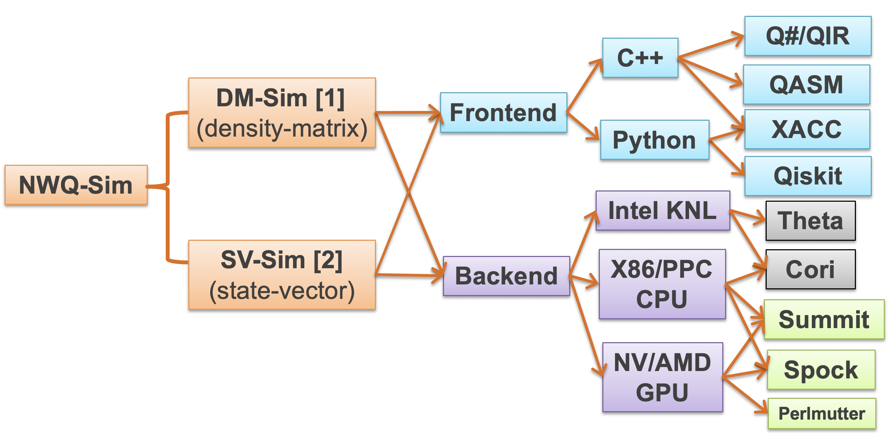
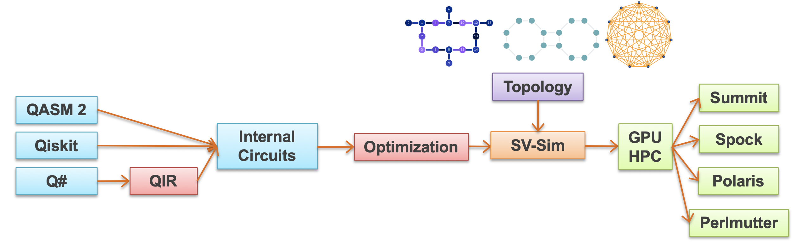
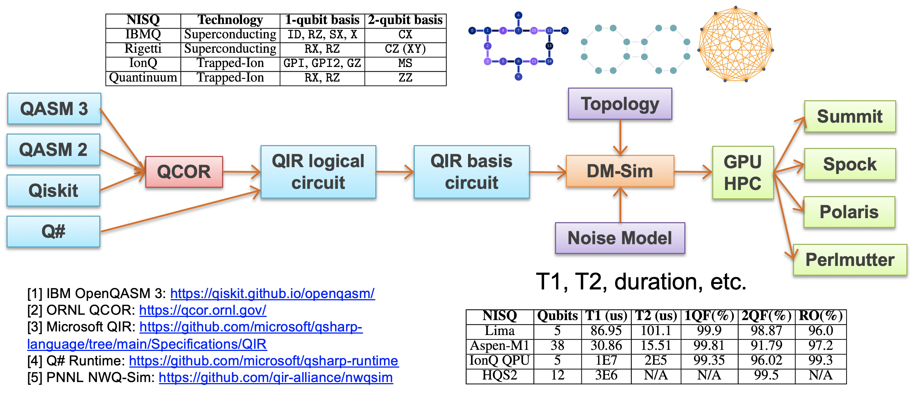

# NWQSim: Northwest Quantum Circuit Simulation Environment 

A Quantum System Simulation Environment on classical multi-node, multi-CPU/GPU heterogeneous HPC systems. It currently includes a state-vector simulator SV-Sim ([SC'21](doc/svsim_sc21)) for high-performance ideal simulation, and a density matrix simulator DM-Sim ([SC'20](doc/dmsim_sc20)) for noise-aware simulation. It supports C++, Python, Q#/QIR, Qiskit, QASM, XACC as the front-ends, and X86/PPC CPU, NVIDIA/AMD GPU as the backends, see below:




### Current version 2.0

NWQSim is under active development. Please raise any bugs and suggest features. 

## About SV-Sim

SV-Sim is implemented in C++/CUDA/HIP for general full-state quantum circuit simulation. It assumes qubits are all-to-all connected unless the input circuits are with respect to circuit topology. We use internal gate representations for advanced optimization and profiling.



SV-Sim supports the following quantum gates as the interface based on [OpenQASM-2](https://arxiv.org/pdf/1707.03429.pdf), [OpenQASM-3](https://arxiv.org/pdf/2104.14722.pdf), [QIR](https://github.com/microsoft/qsharp-runtime/blob/) and [Qiskit](https://qiskit.org/documentation/apidoc/circuit_library.html):


|  Gate  | Format | Meaning |
|:-----: | ------ | ------- |
| X | X(q) | Pauli-X gate on qubit q |
| Y | Y(q) | Pauli-Y gate on qubit q |
| Z | Z(q) | Pauli-Z gate on qubit q |
| H | H(q) | Clifford Hadamard gate on qubit q |
| S | S(q) | Clifford sqrt(Z) phase gate on qubit q |
| SDG | SDG(q) | Clifford inverse of sqrt(Z) on qubit q |
| T | T(q) | sqrt(S) phase gate on qubit q |
| TDG | TDG(q) | Inverst of sqrt(S) on qubit q |
| ID | ID(q) | Identiy gate on qubit q |
| SX | SX(q) | sqrt(X) gate on qubit q, a basis gate for IBMQ |
| RI | RI(theta, q) | Global phase gate, U(0,0,a) in QASM3 or RI in Q#|
| RX | RX(theta, q) | Rotate around X axis for qubit q |
| RY | RY(theta, q) | Rotate around Y axis for qubit q |
| RZ | RZ(theta, q) | Rotate around Z axis for qubit q |
| P  | P(theta, q)  | Phase gate on qubit q as defined by Qiskit | 
| U  | U(theta, phi, lamb, q) | generic singl-qubit rotation gate with 3 Euler angles, see QASM2 | 
| CX | CX(ctrl, q) | CNOT or controlled X gate on qubit q|
| CY | CY(ctrl, q) | Controlled Y gate on qubit q|
| CZ | CZ(ctrl, q) | Controlled Z gate on qubit q|
| CH | CH(ctrl, q) | Controlled H gate on qubit q|
| CS | CS(ctrl, q) | Controlled S gate on qubit q|
| CSDG | CSDG(ctrl, q) | Controlled SDG gate on qubit q|
| CT | CT(ctrl, q) | Controlled T gate on qubit q|
| CTDG | CTDG(ctrl, q) | Controlled TDG gate on qubit q|
| CRX | CRX(theta, ctrl, q) | Controlled RX gate on qubit q|
| CRY | CRY(theta, ctrl, q) | Controlled RY gate on qubit q|
| CRZ | CRZ(theta, ctrl, q) | Controlled RZ gate on qubit q|
| CSX | CSX(ctrl, q) | Controlled SX gate on qubit q|
| CP  | CP(theta, ctrl, q) | Controlled P gate on qubit q|
| CU  | CU(theta, phi, lamb, gamma, ctrl, q) | generic controlled U gate, see Qiskit CU gate | 
| SWAP | SWAP(ctrl, q) | Swap gate on ctrl and q |
| M  | M(q) | measure qubit q on pauli-Z basis |
| MA | MA(n) | sample all qubits for n shots all-together |
| RESET  | RESET(q) | reset qubit q  to zero state | 


Internally, it supports arbitrary 1 or 2 qubit gates for optimization and extension to support new gates:
|  Gate  | Format | Meaning |
|:-----: | ------ | ------- |
| C1 | C1(a0-a3)  | Arbitrary 1-qubit gate |
| C2 | C2(a0-a15) | Arbitrary 2-qubit gate | 

### Prerequisite
SV-Sim in general only requires a C++ compiler. However, in order to build for GPUs or scaling (up and out) or using other APIs (python, qir, qiskit), we need the following libraries:

|  Dependency  | Version | Comments |
|:-----------: | ------- | -------- |
|     CUDA     | 11.0 or later | NVIDIA GPU backend only | 
|     GCC      | 7.0 or later  | Or other native C++ compiler |
|    OpenMP    | Local     | single-node only |
|     MPI      | Local   | CPU multi-node only | 
|   NVSHMEM    | 2.6.0   | NVIDIA GPU cluster scale-out only |
|  Python      | 3.4     | Python API only |
|  Pybind11    | 2.5.0   | Python API only |
|  mpi4py      | 3.0.3   | Python API on cluster only |
|   ROCM       | 3.1.0   | AMD GPU only |
|   Qiskit     | 0.20.0  | Qiskit interface only |
|  Q# runtime  | Local   | Q#/QIR interface only |

### Configure and run on ORNL Summit Supercomputer

```
$ git clone https://github.com/qir-alliance/nwqsim.git 
$ cd nwqsim/env
```
You need to update the env file “setup_summit.sh”, specify the nvshmem path at the end of the LD_LIBRARY_PATH. If you use Q#/QIR, you need to configure the qsharp runtime paths
```
$ source setup_summit.sh
$ cd ../qasm/ibmq_bench/
$ vim Makefile
```
You need to update the Makefile here, mainly the path to NVSHMEM, the GPU arch number, and the project number in run_all.lsf
```
$ make -j 8
$ bsub run_all.lsf
```
Alternatively, you can allocate an interactive job and execute
```
$ bsub -Is -W 20 -nnodes 2 -P CSCXXX  $SHELL
$ ./run_all
```

### Configure and run on NERSC Perlmutter Supercomputer
```
$ git clone https://github.com/qir-alliance/nwqsim.git 
$ cd nwqsim/env
```
You need to update the env file “setup_perlmutter.sh”, specify the nvshmem path at the end of the LD_LIBRARY_PATH. If you use Q#/QIR, you need to configure the qsharp runtime paths
```
$ source setup_perlmutter.sh
$ cd ../svsim/qasm/ibmq_bench/
$ vim makefile_perlmutter
```
You need to update the Makefile here, mainly the path to NVSHMEM.
```
$ make -j 8 -f makefile_perlmutter
```
Alternatively, you can allocate an interactive job and execute
```
$ salloc -N 2 -n 8 --qos interactive_ss11 --time 60:00 --constraint gpu -c 1 -G 8 --gpus-per-task 1 --account=m4142_g
$ ./run_all_perlmutter.sh
```


## About DM-Sim

DM-Sim is implemented in C++/CUDA/HIP for general density-matrix quantum circuit simulation with noise. It needs to load backend device calibration data (including topology, T1, T2, SPAM, etc.) as a json file for runtime configuration to the simulator instance.  
We use an array to store the internal gate representations and perform density matrix gate fusion (with more restrictions compared to state-vector) for advanced performance.  



#### Noisy Simulation for IBMQ devices
DM-Sim supports the following basis quantum gates for IBMQ devices:

|  Gate  | Format | Meaning |
|:-----: | ------ | ------- |
| X | X(q) | Pauli-X gate on qubit q |
| ID | ID(q) | Identiy gate on qubit q |
| SX | SX(q) | sqrt(X) gate on qubit q, a basis gate for IBMQ |
| RZ | RZ(theta, q) | Rotate around Z axis for qubit q |
| CX | CX(ctrl, q) | CNOT or Controlled X gate on qubit q|


#### Noisy Simulation for Rigetti devices

|  Gate  | Format | Meaning |
|:-----: | ------ | ------- |
| RX  | | |
| RZ  | | |
| CX  | | |

#### Noisy Simulation for IonQ devices

|  Gate  | Format | Meaning |
|:-----: | ------ | ------- |
| GPI  | | |
| GPI2  | | |
| GZ  | | |
| MS  | | |


#### Noisy Simulation for Quantinuum devices
|  Gate  | Format | Meaning |
|:-----: | ------ | ------- |
| RX  | | |
| RZ  | | |
| ZZ  | | |


Internally, it supports arbitrary 1 or 2 qubit gates for optimization and extension to support new gates:
|  Gate  | Format | Meaning |
|:-----: | ------ | ------- |
| C2 | C2(array of 0-15)  | Arbitrary density-matrix 1-qubit gate |
| C4 | C4(array of 0-255) | Arbitrary density-matrix 2-qubit gate | 


### Prerequisite
DM-Sim generally only requires a C++ compiler. However, in order to build for GPUs or scaling (up and out) or using other APIs (python, qir, qiskit), we need the following libraries:

|  Dependency  | Version | Comments |
|:-----------: | ------- | -------- |
|     CUDA     | 11.0 or later | NVIDIA GPU backend only | 
|     GCC      | 7.0 or later  | Or other native C++ compiler |
|    OpenMP    | Local     | single-node only |
|     MPI      | Local   | CPU multi-node only | 
|   NVSHMEM    | 2.6.0   | NVIDIA GPU cluster scale-out only |
|  Python      | 3.4     | Python API only |
|  Pybind11    | 2.5.0   | Python API only |
|  mpi4py      | 3.0.3   | Python API on cluster only |
|   ROCM       | 3.1.0   | AMD GPU only |
|   Qiskit     | 0.20.0  | Qiskit interface only |
|  Q# runtime  | Local   | Q#/QIR interface only |

### Configure and run on ORNL Summit Supercomputer

```
$ git clone https://github.com/qir-alliance/nwqsim.git 
$ cd nwqsim/env
```
You need to update the env file “setup_summit.sh”, specify the nvshmem path at the end of the LD_LIBRARY_PATH. If you use Q#/QIR, you need to configure the qsharp runtime paths
```
$ source setup_summit.sh
$ cd ../dmsim/qasm/ibmq_bench/
$ vim Makefile
```
You need to update the Makefile here, mainly the path to NVSHMEM, the GPU arch number, and the project number in run_all.lsf
```
$ make -j 8
$ bsub run_all.lsf
```
Alternatively, you can allocate an interactive job and execute
```
$ bsub -Is -W 20 -nnodes 2 -P CSCXXX  $SHELL
$ ./run_all
```

### Configure and run on NERSC Perlmutter Supercomputer
```
$ git clone https://github.com/qir-alliance/nwqsim.git 
$ cd nwqsim/env
```
You need to update the env file “setup_perlmutter.sh”, specify the nvshmem path at the end of the LD_LIBRARY_PATH. If you use Q#/QIR, you need to configure the qsharp runtime paths
```
$ source setup_perlmutter.sh
$ cd ../qasm/ibmq_bench/
$ vim Makefile
```
You need to update the Makefile here, mainly the path to NVSHMEM.
```
$ make -j 8
```
Alternatively, you can allocate an interactive job and execute
```
$ ./run_all
```


## Authors 

#### [Ang Li](http://www.angliphd.com/), Senior Computer Scientist, Pacific Northwest National Laboratory (PNNL)

Additionally, the following folks contribute the project:

 - Sriram Krishnamoorthy, Pacific Northwest National Laboratory 
 - Bo Fang, Pacific Northwest National Laboratory
 - Muqing Zheng, Lehigh University and Pacific Northwest National Laboratory
 - Cassandra Granade, Microsoft
 - Martin Roetteler, Microsoft
 - Bettina Heim, Microsoft
 - Robin Kuzmin, Microsoft
 - Stefan Wernli, Microsoft
 - Guen Prawiroatmodjo, Microsoft
 - Alan Geller, Microsoft
 - Samuel Stein, Pacific Northwest National Laboratory
 - Thien Nguyen, Oak Ridge National Laboratory


## Citation format

Please cite our SC'20 and SC'21 papers:
 - Ang Li, Bo Fang, Christopher Granade, Guen Prawiroatmodjo, Bettina Heim, Martin Roetteler and Sriram Krishnamoorthy, "SV-Sim: Scalable PGAS-based State Vector Simulation of Quantum Circuits" In Proceedings of the International Conference for High Performance Computing, Networking, Storage and Analysis, 2021.
 - Ang Li, Omer Subasi, Xiu Yang, and Sriram Krishnamoorthy. "Density Matrix Quantum Circuit Simulation via the BSP Machine on Modern GPU Clusters." In Proceedings of the International Conference for High Performance Computing, Networking, Storage and Analysis, 2020.

Bibtex:
```text
@inproceedings{li2021svsim,
    title={SV-Sim: Scalable PGAS-based State Vector Simulation of Quantum Circuits},
    author={Li, Ang and Fang, Bo and Granade, Christopher and Prawiroatmodjo, Guen and Hein, Bettina and Rotteler, Martin and Krishnamoorthy, Sriram},
    booktitle={Proceedings of the International Conference for High Performance Computing, Networking, Storage and Analysis},
    year={2021}
}
@inproceedings{li2020density,
    title={Density Matrix Quantum Circuit Simulation via the BSP Machine on Modern GPU Clusters},
    author={Li, Ang and Subasi, Omer and Yang, Xiu and Krishnamoorthy, Sriram},
    booktitle={Proceedings of the International Conference for High Performance Computing, Networking, Storage and Analysis},
    year={2020}
}
``` 

## License

This project is licensed under the MIT License, see [LICENSE](LICENSE) file for details.

## Acknowledgments

**PNNL-IPID: 32166-E, ECCN: EAR99, IR: PNNL-SA-161181**

This project is fully supported by the [Quantum Science Center (QSC)](https://qscience.org/).The Pacific Northwest National Laboratory (PNNL) is operated by Battelle for the U.S. Department of Energy (DOE) under contract DE-AC05-76RL01830. 

## Contributing

Please contact us If you'd like to contribute to SV-Sim. See the contact in our paper or my [webpage](http://www.angliphd.com).


