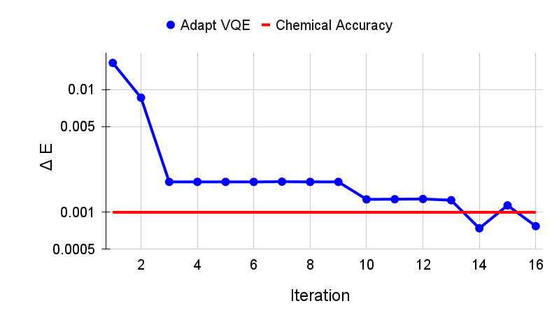

# User Manual

NWQ-Sim in general only requires a C++ compiler. However, in order to build for GPUs or scaling (up and out) or using other APIs (python, qir, qiskit), we need the following libraries:

## Dependencies

NWQ-Sim has certain dependencies based on the features you want to utilize. The core requirements are:

* C++ Compiler (GCC 7.0 or later recommended)
* CMake 3.20 or later (Project Build Tool)

Additional dependencies depend on the specific features you require:

* OpenMP (for local single-node execution)
* MPI (for multi-node execution)
* CUDA 11.0 or later (for NVIDIA GPU Backend)
* NVSHMEM 2.9.0 or later (for NVIDIA GPU Cluster Scale-out)
* ROCM 3.1.0 (for AMD GPU Backend)
* XACC (for Frontend VQE Algorithm)
* Python 3.4 (for Python API)
* Pybind11 2.5.0 (for Python API)
* mpi4py 3.0.3 (for Python API on a cluster)
* Qiskit 0.20.0 (for Qiskit interface)
* Q# runtime (for Q#/QIR interface)

## <a id="build_base"></a>Build from Source

NWQ-Sim uses CMake for building, which automatically detects the execution environment, determines which backends to build, and includes the appropriate libraries accordingly. To build NWQ-Sim from source, follow these steps:

1. Clone the NWQ-Sim repository:
```bash
git clone https://github.com/pnnl/NWQ-Sim.git
cd NWQ-Sim
```
2. Create a build directory and navigate into it:
```bash
mkdir build
cd build
```
3. Configure the project using CMake and build
```bash
cmake ..
make -j4
```


## Build on HPC Systems

For multi-GPU execution on HPCs with NVIDIA GPUs, NWQ-Sim requires the NVSHMEM library. However, the current version of NVSHMEM library has a known issue that restricts each GPU to utilize no more than 2GB of GPU memory. To overcome this limitation, we have incorporated a fix in our source code.

### OLCF Frontier HPC

Currently, for AMD CPU, single/OpenMP/MPI work, for AMD GPU, only single AMD MI250X GPU works.

Follow these steps to build NWQ-Sim on the OLCF Frontier HPC:

1. Initialize the environment with provided script

```bash
source ~/NWQ-Sim/environment/setup_frontier.sh
```

1. Clone the NWQ-Sim repository:
```bash
git clone https://github.com/pnnl/NWQ-Sim.git
cd NWQ-Sim
```
2. Create a build directory and navigate into it:
```bash
mkdir build
cd build
```
3. Configure the project using CMake
```bash
cmake ..
```
4. (ISSUE) Default clang++ compiler on Frontier HPC produces slow-running code. hipcc improves performance but can't be set directly in CMake. A temporary fix is provided below to replace clang++ with hipcc in build scripts:

```bash
sed -i 's|/opt/rocm-5.3.0/llvm/bin/clang++|hipcc|g' qasm/CMakeFiles/nwq_qasm.dir/build.make
```
5. Build
```bash
make -j4
```

### OLCF Summit HPC

Follow these steps to build NWQ-Sim on the OLCF Summit HPC:

1. Initialize the environment with provided script

```bash
source ~/NWQ-Sim/environment/setup_summit.sh
```

2. Build NVSHMEM
* Download and extract the NVSHMEM txz archive from [here](https://developer.download.nvidia.com/compute/redist/nvshmem/). For example, to download and extract NVSHMEM 2.9.0:
```bash
wget https://developer.download.nvidia.com/compute/redist/nvshmem/2.9.0/source/nvshmem_src_2.9.0-2.tar.xz

tar -xf nvshmem_src_2.9.0-2.tar.xz
```
* For NVSHMEM version older than 2.10, replace the mem.cpp file in nvshmem_src

```bash
cp ~/NWQ-Sim/nvshmem_util/mem.cpp ~/nvshmem_src_2.9.0-2/src/mem/mem.cpp
```

* Copy the provided NVSHMEM build script to nvshmem_src folder and then build it
```bash
cp ~/NWQ-Sim/nvshmem_util/scripts/build_nvshmem_summit.sh ~/nvshmem_src_2.9.0-2/
cd ~/nvshmem_src_2.9.0-2
./build_nvshmem_summit.sh
```
Note, the current bootstrape of nvshmem on Summit requires gcc 9 or 10. 

Finally, build NWQ-Sim using the steps in [Build from Source](#build_base)


### NERSC Perlmutter HPC


Follow these steps to build NWQ-Sim on the NERSC Perlmutter HPC:

1. Initialize the environment with provided script

```bash
source ~/NWQ-Sim/environment/setup_perlmutter.sh
```

2. Build NVSHMEM
* Download and extract the NVSHMEM txz archive from [here](https://developer.download.nvidia.com/compute/redist/nvshmem/). For example, to download and extract NVSHMEM 2.11.0:
```bash
wget https://developer.download.nvidia.com/compute/redist/nvshmem/2.11.0/source/nvshmem_src_2.11.0-5.txz

tar -xf nvshmem_src_2.11.0-5.txz
```
* Find the mem.cpp file in nvshmem_src in

```bash
nvshmem_src_2.11.0-5/src/host/mem/mem.cpp
```
Comment out the line (line 41)

```c
#include "common/nvshmem_common_ibgda.h"
```

* Copy the provided NVSHMEM build script to nvshmem_src folder
```bash
cp ~/NWQ-Sim/nvshmem_util/scripts/build_nvshmem_perlmutter.sh ~/nvshmem_src_2.11.0-5/
cd ~/nvshmem_src_2.11.0-5
```
add the following configurations into the build file "build_nvshmem_perlmutter.sh" before the cmake command.
```bash
export NVSHMEM_IBGDA_SUPPORT=0
export NVSHMEM_IBRC_SUPPORT=0
export NVSHMEM_IBDEVX_SUPPORT=0
```

* Compile and build NVSHMEM
```bash
./build_nvshmem_perlmutter.sh
```

Finally, build NWQ-Sim using the steps in [Build from Source](#build_base)

### ALCF Theta HPC

Follow these steps to build NWQ-Sim on the Argonne ALCF Theta HPC:

Initialize the environment with provided script

```bash
source ~/NWQ-Sim/environment/setup_theta.sh
```

Then build NWQ-Sim using the steps in [Build from Source](#build_base)


## Program Runtime Configuration Options

This guide provides detailed instructions on how to execute the compiled program along with the available command-line arguments to configure the program runtime.

**Location:** Navigate to the `build` directory in your local project workspace.

**Execution:** Run the executable program with the desired command-line arguments to adjust program behaviors as needed. Here is a comprehensive list of the command-line arguments:

- `-q`: Executes a simulation with the given QASM file.

- `-t <index>`: Runs the testing benchmarks for the specific index provided.

- `-a`: Runs all testing benchmarks. 

- `-backend list`: Lists all the available backends. The list of available backends are:
  - CPU
  - OpenMP
  - MPI
  - NVGPU
  - NVGPU_MPI
  - AMDGPU


- `-backend <name>`: Sets the backend for your program to the specified one. The backend name string is case-insensitive.

- `-shots <value>`: Configures the total number of shots.

- `-basis`: Activates the program to run benchmark circuits using only basis gates.

- `-sim <method>`: Sets the simulation method. There are two available options:
  - `sv`: Stochastic Vector simulation.
  - `dm`: Density Matrix simulation. Please note, when running with `dm`, the given circuit can only contain IBM basis gates and 2-qubit gates that are included in the device configuration file specified in the default_configuration.json file.

**Example Usage:** To run the qasm frontend from the `build` directory with a specific backend, a total number of shots, and a simulation method, use the following command: 

```
./qasm/nwq_qasm -backend <name> -shots <value> -sim <method> -q <path/to/qasm>
```

Replace `<name>`, `<value>`, `<method>`, and `<path/to/qasm>` with your desired backend name, number of shots, and simulation method respectively.

Please ensure that you replace `/qasm/nwq_qasm` with the actual name of your compiled executable file if not using the qasm frontend.

### Running on Frontier HPC

To run NWQ-Sim on the Frontier or Crusher Supercomputer, initilize the environment first
```bash
source ~/NWQ-Sim/environment/setup_frontier.sh
```
Launch multi-CPU execution for regular or interactive jobs:
```bash
srun -N <nodes> -n <CPUS> ./qasm/nwq_qasm <NWQ-Sim Command> -backend MPI
```
For example:
```bash
srun -N 4 -n 32 ./qasm/nwq_qasm -backend MPI -q ../data/openqasm/adder_n28.qasm
```

### Running on Summit HPC

To run NWQ-Sim on the Summit Supercomputer, initilize the environment first
```bash
source ~/NWQ-Sim/environment/setup_summit.sh
```

Launch multi-GPU execution for regular or interactive jobs:
```bash
jsrun -n<GPUS> -a1 -g1 -c1 -brs <NWQ-Sim Command> -backend NVGPU_MPI
```
When using multi-nodes, nvshmem requires the same number of PEs for all nodes. Since each Summit node has 6 GPUs, we need to specify 4 per nodes. An example is given in the following:
```bash
jsrun -n 64 -a1 -g1 -c1 -r4 ./qasm/nwq_qasm -q ../data/openqasm/bv_n14.qasm -backend NVGPU_MPI
```

Replace <GPUS> with the total number of GPUs, and <NWQ-Sim Command> with the NWQ-Sim execution command.

### Running on Perlmutter HPC
To run NWQ-Sim on the Perlmutter Supercomputer, initialize the environment first
```bash
source ~/NWQ-Sim/environment/setup_perlmutter.sh
```

Launch multi-GPU execution for regular or interactive jobs:
```bash
srun -C gpu -N <NODES> -n <GPUS> -c 1 --gpus-per-task=1 --gpu-bind=single:1 <NWQ-Sim Command> -backend NVGPU_MPI
```

Replace `<NODES>` with the number of compute nodes, `<GPUS>` with the total number of GPUs, and `<NWQ-Sim Command>` with the NWQ-Sim execution command.


### Running on Theta HPC

To run NWQ-Sim on the Theta Supercomputer, initilize the environment first
```bash
source ~/NWQ-Sim/environment/setup_theta.sh
```

Launch regular or interactive jobs and use the following command to execute:
```bash
aprun -n <NODES> -N 1 <NWQ-Sim Command> -backend MPI
```
Replace `<NODES>` with the number of compute nodes


## NWQ-Sim for Chemistry Simulations

NWQ-Sim is also capable of conducting chemistry simulations using the XACC frontend, such as Variational Quantum Eigensolver (VQE) simulations. This allows for a range of complex quantum chemical computations using NWQ-Sim.

Below is an example of how to use NWQ-Sim with the XACC frontend for a VQE simulation:


1. Install XACC by following the steps outlined in the [XACC repository](https://github.com/eclipse/xacc#build-from-source).

Note, to successfully install and run XACC on Summit, you need to:
```bash
module load openblas
```
Also, do not use all threads to build (make -j$(nproc --all) install) which draws error, use:
```bash
make -j8 install
```

To successfully install XACC on Frontier, you need to load the two modules (the default cray-python/3.9 won't work)
```bash
module load openblas/0.3.17
module load cray-python/3.10.10
```

2. Navigate to /NWQSim/xacc folder and create a source file.
2. Include the NWQ-Sim backend implementation in your code:
```c++
#include "nwq_accelerator.hpp"
```

4. Create an NWQAccelerator object:
```c++
auto nwq_acc = std::make_shared<xacc::quantum::NWQAccelerator>();
``` 

5. Utilize the NWQAccelerator with XACC. For example, you can run XACC-VQE:
```c++
 xacc::Initialize(argc, argv);

// Get reference to the Accelerator
auto nwq_acc = std::make_shared<xacc::quantum::NWQAccelerator>();

nwq_acc->updateConfiguration(
  { std::make_pair("shots", 4096),
    std::make_pair("backend", "cpu"),
    std::make_pair("sim-method", "sv"),
  });

// Create the N=2 deuteron Hamiltonian
auto H_N_2 = xacc::quantum::getObservable(
    "pauli", std::string("5.907 - 2.1433 X0X1 "
                          "- 2.1433 Y0Y1"
                          "+ .21829 Z0 - 6.125 Z1"));

auto optimizer = xacc::getOptimizer("mlpack");

// JIT map Quil QASM Ansatz to IR
xacc::qasm(R"(
.compiler xasm
.circuit deuteron_ansatz
.parameters theta
.qbit q
X(q[0]);
Ry(q[1], theta);
CNOT(q[1],q[0]);
)");

auto ansatz = xacc::getCompiled("deuteron_ansatz");

// Get the VQE Algorithm and initialize it
auto vqe = xacc::getAlgorithm("vqe");
vqe->initialize({std::make_pair("ansatz", ansatz),
                  std::make_pair("observable", H_N_2),
                  std::make_pair("accelerator", accelerator),
                  std::make_pair("optimizer", optimizer)});

// Allocate some qubits and execute
auto buffer = xacc::qalloc(2);
vqe->execute(buffer);
xacc::Finalize();
```

Replace the target source file in `NWQ-Sim/xacc/CMakeList.txt` and build the project. The executable will be located at `NWQ-Sim/build/xacc/nwq_xacc`.

### Example Execution

Here, we illustrate an execution of the Adapt VQE simulation on a water molecule using NWQ-Sim. The chart below depicts the variation in delta energy per iteration of the algorithm. As observed, the desired chemical accuracy is achieved around the 14th iteration, demonstrating the effectiveness of the approach.



Please note, this is an example; actual results may vary based on the specific quantum chemistry problem and the precision of your Hamiltonian.

## C++ Tutorial
### 1. Essential Libraries

Include the necessary libraries at the beginning of your program. 

```cpp
#include "include/backendManager.hpp"
#include "include/state.hpp"
#include "include/circuit.hpp"
#include "include/nwq_util.hpp"
```

### 2. Building the Quantum Circuit

Construct your quantum circuit with the provided functions. The gate

```cpp
// Create a circuit with 2 qubits
int n_qubits = 2;
auto circuit = std::make_shared<Circuit>(n_qubits);

// Add some gates to the circuit
circuit->H(0);
circuit->CX(0, 1);
circuit->RZ(0.125, 0);
```

### 3. Preparing the Quantum State
Set up the quantum state simulation backend.

```cpp
std::string backend = "CPU";
std::string sim_method = "sv";
auto state = BackendManager::create_state(backend, n_qubits, sim_method);
```

### 4. Running The Simulation and Gathering Results

Finally, you can run your quantum circuit with your prepared state and gather the results. The measurement operation can be added in circuit or can be directly called from state.

```cpp
// Add measurement operation to circuit then simulate
int shots = 1024;
circuit->MA(shots);
state->sim(circuit);
long long int *result = state->get_results();
```
or
```cpp
// Simulate and then directly sample from state
int shots = 1024;
state->sim(circuit);
long long int *result = state->measure_all(shots);
```
